# 虚拟化管控后端

<cite>
**本文引用的文件**
- [server/main.go](file://server/main.go)
- [server/go.mod](file://server/go.mod)
- [server/router/router.go](file://server/router/router.go)
- [server/config/config.go](file://server/config/config.go)
- [server/model/db.go](file://server/model/db.go)
- [server/middleware/auth.go](file://server/middleware/auth.go)
- [server/service/libvirt_rpc/connection.go](file://server/service/libvirt_rpc/connection.go)
- [server/taskqueue/queue.go](file://server/taskqueue/queue.go)
- [server/service/vm/types.go](file://server/service/vm/types.go)
- [server/service/network/types.go](file://server/service/network/types.go)
- [server/service/storage/pool/types.go](file://server/service/storage/pool/types.go)
- [server/handler/types.go](file://server/handler/types.go)
- [server/handler/vm.go](file://server/handler/vm.go)
</cite>

## 目录
1. [简介](#简介)
2. [项目结构](#项目结构)
3. [核心组件](#核心组件)
4. [架构总览](#架构总览)
5. [详细组件分析](#详细组件分析)
6. [依赖分析](#依赖分析)
7. [性能考量](#性能考量)
8. [故障排查指南](#故障排查指南)
9. [结论](#结论)
10. [附录](#附录)

## 简介
本项目是一个基于 Go 的虚拟化管控后端，围绕 KVM/QEMU 虚拟机进行统一管理，提供虚拟机生命周期管理、网络与存储管理、快照与克隆、带宽与资源调度、任务队列与异步执行、认证与权限控制等能力。系统采用 Gin 框架提供 REST API，使用 SQLite 作为本地数据库，通过 go-libvirt 与 libvirt 进行通信，支持 OVS 网络后端，并提供完善的中间件体系（认证、限流、CORS、SSE 等）。

## 项目结构
后端代码位于 server 目录，按职责划分为以下主要模块：
- config：全局配置加载与校验
- model：数据库模型与迁移
- router：路由定义与中间件装配
- middleware：认证、限流、CORS、请求日志等中间件
- service/*：业务服务层（虚拟机、网络、存储、防火墙、带宽、模板、克隆、调度等）
- handler/*：HTTP 请求处理器
- taskqueue：任务队列与 SSE 事件推送
- logger：日志模块
- utils：通用工具
- main.go：应用入口

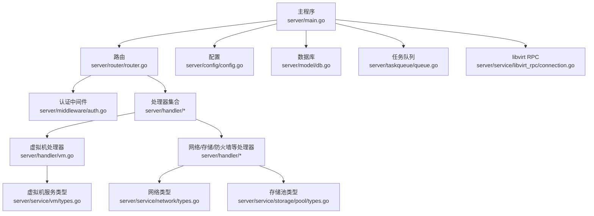

图示来源
- [server/main.go:1-128](file://server/main.go#L1-L128)
- [server/router/router.go:18-485](file://server/router/router.go#L18-L485)
- [server/config/config.go:157-249](file://server/config/config.go#L157-L249)
- [server/model/db.go:57-116](file://server/model/db.go#L57-L116)
- [server/taskqueue/queue.go:173-181](file://server/taskqueue/queue.go#L173-L181)
- [server/service/libvirt_rpc/connection.go:20-43](file://server/service/libvirt_rpc/connection.go#L20-L43)
- [server/handler/vm.go:81-126](file://server/handler/vm.go#L81-L126)

章节来源
- [server/main.go:1-128](file://server/main.go#L1-L128)
- [server/router/router.go:18-485](file://server/router/router.go#L18-L485)
- [server/config/config.go:157-249](file://server/config/config.go#L157-L249)
- [server/model/db.go:57-116](file://server/model/db.go#L57-L116)
- [server/taskqueue/queue.go:173-181](file://server/taskqueue/queue.go#L173-L181)
- [server/service/libvirt_rpc/connection.go:20-43](file://server/service/libvirt_rpc/connection.go#L20-L43)
- [server/handler/vm.go:81-126](file://server/handler/vm.go#L81-L126)

## 核心组件
- 应用入口与启动流程：初始化配置、日志、数据库、libvirt 连接、VM 缓存、任务处理器注册、定时任务、路由与服务启动。
- 路由与中间件：统一装配 CORS、限流、请求日志、认证、管理员与弹性云权限控制等。
- 任务队列：支持多工作协程、SSE 推送、任务取消、自动清理、处理器注册。
- 数据库与模型：SQLite 初始化、自动迁移、兼容性修复、默认管理员创建。
- 认证与权限：JWT 与 API Key 双通道认证、角色与操作范围控制、VM 访问权限校验。
- libvirt RPC：连接初始化、可用性检测、自动重连、关闭。
- 业务服务：虚拟机管理、网络与 VPC、存储池、防火墙、带宽、模板与克隆、调度与计划任务等。

章节来源
- [server/main.go:31-128](file://server/main.go#L31-L128)
- [server/router/router.go:18-485](file://server/router/router.go#L18-L485)
- [server/taskqueue/queue.go:173-354](file://server/taskqueue/queue.go#L173-L354)
- [server/model/db.go:57-116](file://server/model/db.go#L57-L116)
- [server/middleware/auth.go:75-199](file://server/middleware/auth.go#L75-L199)
- [server/service/libvirt_rpc/connection.go:20-98](file://server/service/libvirt_rpc/connection.go#L20-L98)

## 架构总览
系统采用“路由 -> 中间件 -> 处理器 -> 服务 -> libvirt/系统”的分层架构。处理器负责参数校验与权限控制，服务层封装业务逻辑与资源编排，libvirt 作为底层虚拟化控制面，SQLite 作为元数据存储。

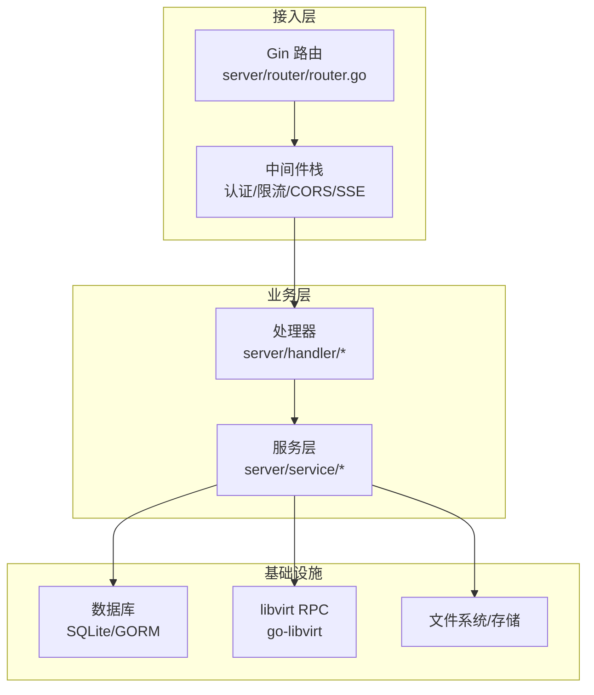

图示来源
- [server/router/router.go:18-485](file://server/router/router.go#L18-L485)
- [server/middleware/auth.go:75-199](file://server/middleware/auth.go#L75-L199)
- [server/handler/vm.go:214-352](file://server/handler/vm.go#L214-L352)
- [server/service/libvirt_rpc/connection.go:20-98](file://server/service/libvirt_rpc/connection.go#L20-L98)
- [server/model/db.go:57-116](file://server/model/db.go#L57-L116)

## 详细组件分析

### 应用入口与启动流程
- 初始化配置与安全校验：加载环境变量与数据库持久化配置，执行安全检查（默认密钥禁止生产使用）。
- 初始化日志、数据库与 libvirt 连接：失败即终止，保证启动一致性。
- VM 缓存同步、安全与网络恢复：确保运行态一致性。
- 注册任务处理器与启动任务队列、定时任务。
- 设置路由并启动 HTTP 服务。

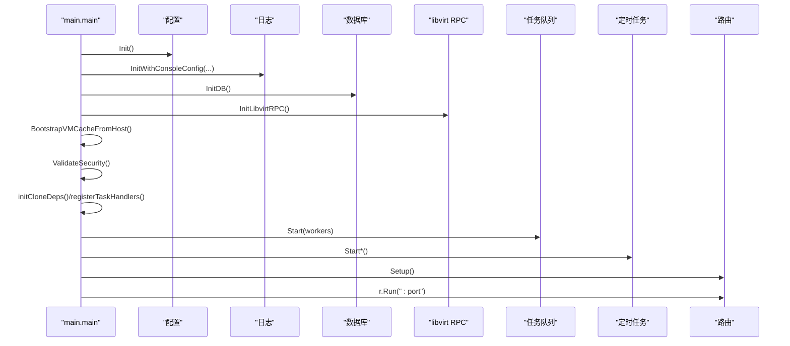

图示来源
- [server/main.go:31-128](file://server/main.go#L31-L128)

章节来源
- [server/main.go:31-128](file://server/main.go#L31-L128)

### 路由与中间件
- 路由分组：公共设置、认证、高风险操作、系统设置、认证后接口、管理员接口、用户自助、宿主机监控、任务队列、调度事件中心等。
- 中间件：CORS、限流、请求日志、JWT/API Key 认证、管理员权限、弹性云限制、VM 访问权限校验。
- 静态文件服务：自动发现 web-dist 目录，支持 SPA 回退。

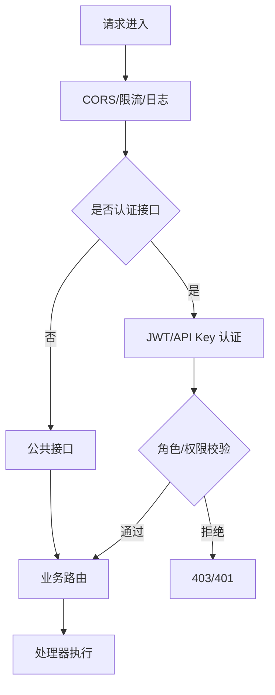

图示来源
- [server/router/router.go:18-485](file://server/router/router.go#L18-L485)
- [server/middleware/auth.go:75-199](file://server/middleware/auth.go#L75-L199)

章节来源
- [server/router/router.go:18-485](file://server/router/router.go#L18-L485)
- [server/middleware/auth.go:75-199](file://server/middleware/auth.go#L75-L199)

### 任务队列与 SSE
- 任务模型：内存存储、状态机、SSE 广播、取消机制、自动清理。
- 处理器注册：按任务类型注册处理函数，支持进度回调。
- 并发：多工作协程消费任务通道，异步执行耗时操作。

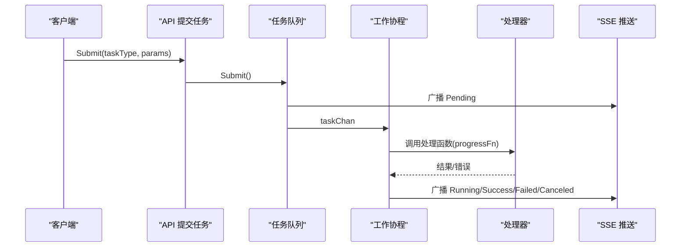

图示来源
- [server/taskqueue/queue.go:173-354](file://server/taskqueue/queue.go#L173-L354)

章节来源
- [server/taskqueue/queue.go:173-354](file://server/taskqueue/queue.go#L173-L354)

### 数据库与模型
- 初始化：确保数据目录存在，打开 SQLite，GORM 日志适配。
- 自动迁移：包含用户、API Key、VM 统计、端口转发、主机统计、系统设置、VPC、公共 IP、调度事件、锁等。
- 兼容性迁移：修复历史字段、索引重建、默认值补齐、用户状态修复等。
- 默认管理员：首次启动自动创建默认管理员账号。

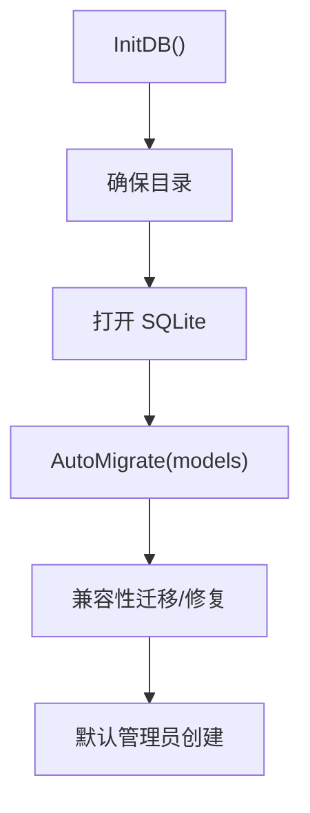

图示来源
- [server/model/db.go:57-116](file://server/model/db.go#L57-L116)
- [server/model/db.go:118-373](file://server/model/db.go#L118-L373)

章节来源
- [server/model/db.go:57-116](file://server/model/db.go#L57-L116)
- [server/model/db.go:118-373](file://server/model/db.go#L118-L373)

### 认证与权限
- JWT 与 API Key：支持两种认证方式，令牌类型区分（access/bootstrap），支持操作范围。
- 角色与状态：管理员、用户、激活/禁用状态、安全更新时间校验。
- VM 访问控制：非管理员用户仅能操作自身 VM；弹性云用户限制访问弹性云专属能力。
- 安全校验：默认密钥禁止生产使用，开发模式仅警告。

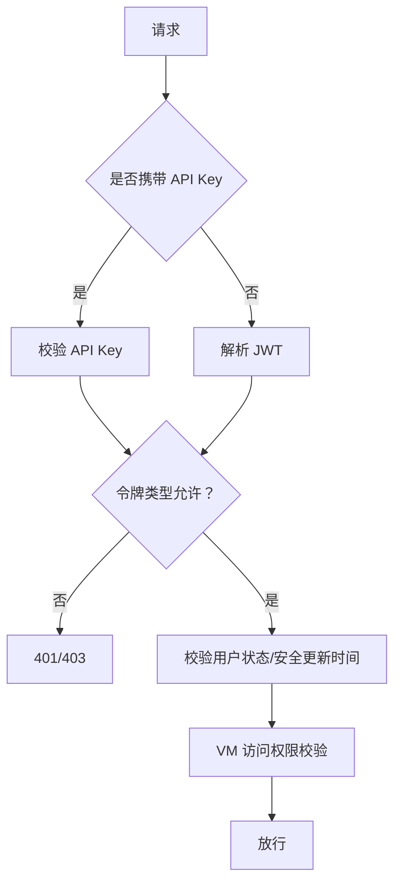

图示来源
- [server/middleware/auth.go:75-199](file://server/middleware/auth.go#L75-L199)

章节来源
- [server/middleware/auth.go:75-199](file://server/middleware/auth.go#L75-L199)

### libvirt RPC
- 初始化：连接 /var/run/libvirt/libvirt-sock，查询版本验证。
- 可用性：IsLibvirtRPCAvailable 快速检测。
- 重连：最多三次指数退避重连。
- 关闭：优雅断开连接。

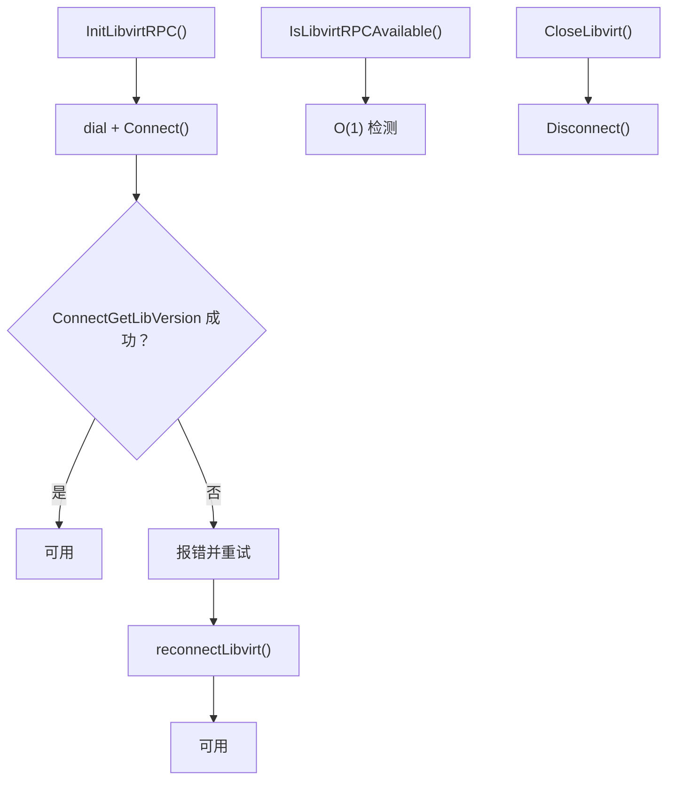

图示来源
- [server/service/libvirt_rpc/connection.go:20-98](file://server/service/libvirt_rpc/connection.go#L20-L98)

章节来源
- [server/service/libvirt_rpc/connection.go:20-98](file://server/service/libvirt_rpc/connection.go#L20-L98)

### 虚拟机管理（处理器与类型）
- 处理器：列表、详情、XML、IP、操作（开机/关机/重启/重置/强制断电）、编辑、网络诊断、VNC、磁盘、CD/DVD、救援、共享目录、计划任务等。
- 类型：VmInfo/VmDetail/VmStats、引导设备、主机统计、XML 结构体等。

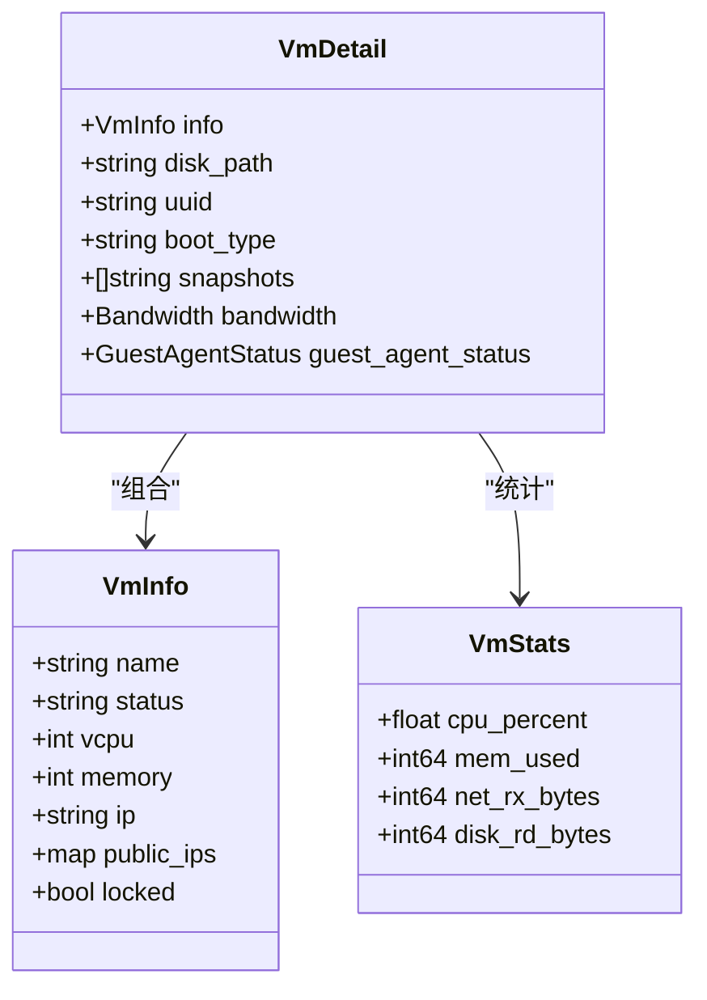

图示来源
- [server/service/vm/types.go:21-116](file://server/service/vm/types.go#L21-L116)

章节来源
- [server/handler/vm.go:81-352](file://server/handler/vm.go#L81-L352)
- [server/service/vm/types.go:21-116](file://server/service/vm/types.go#L21-L116)

### 网络与存储类型
- 网络：静态 IP、DHCP 租约、端口转发规则、稳定键、添加/更新参数等。
- 存储：宿主机存储池信息、VM 存储目标、ISO 文件信息、lsblk/findmnt 输出结构等。

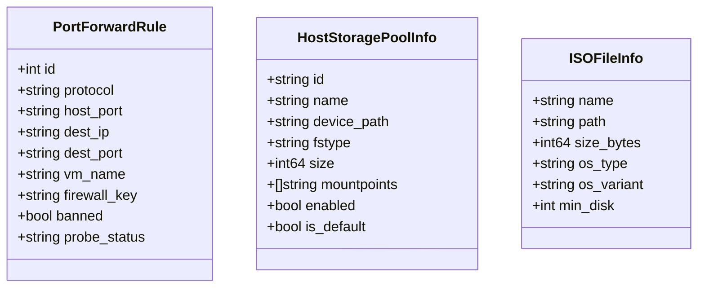

图示来源
- [server/service/network/types.go:27-96](file://server/service/network/types.go#L27-L96)
- [server/service/storage/pool/types.go:8-82](file://server/service/storage/pool/types.go#L8-L82)

章节来源
- [server/service/network/types.go:27-96](file://server/service/network/types.go#L27-L96)
- [server/service/storage/pool/types.go:8-82](file://server/service/storage/pool/types.go#L8-L82)

### 处理器参数与请求模型
- 虚拟机操作请求：action=start/shutdown/destroy/reboot/reset。
- 虚拟机编辑请求：CPU/内存/引导/网卡/视频/PCIe/磁盘/IOPS/带宽等。
- 救援系统请求：action=start/stop。

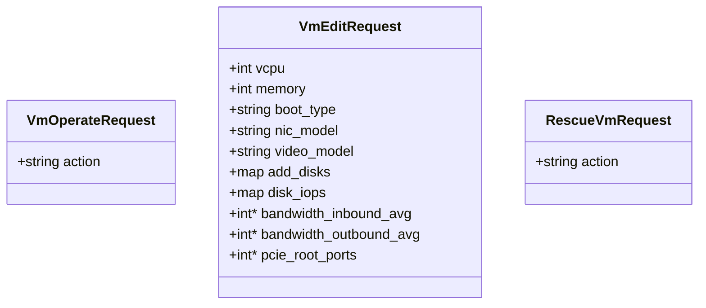

图示来源
- [server/handler/types.go:9-59](file://server/handler/types.go#L9-L59)

章节来源
- [server/handler/types.go:9-59](file://server/handler/types.go#L9-L59)

## 依赖分析
- 外部依赖：gin、jwt、websocket、go-libvirt、bcrypt、gorm/sqlite、lumberjack 等。
- 模块耦合：路由依赖中间件与处理器；处理器依赖服务层；服务层依赖 libvirt 与数据库；任务队列独立但与处理器协作。

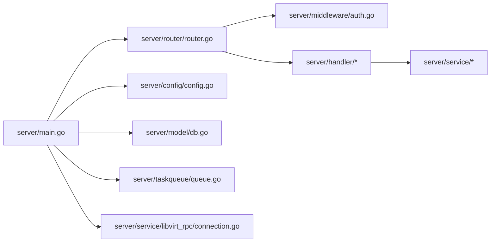

图示来源
- [server/go.mod:5-15](file://server/go.mod#L5-L15)
- [server/main.go:31-128](file://server/main.go#L31-L128)
- [server/router/router.go:18-485](file://server/router/router.go#L18-L485)

章节来源
- [server/go.mod:5-15](file://server/go.mod#L5-L15)
- [server/main.go:31-128](file://server/main.go#L31-L128)
- [server/router/router.go:18-485](file://server/router/router.go#L18-L485)

## 性能考量
- 任务队列并发：多工作协程并行处理，适合高并发异步任务。
- SSE 实时推送：任务进度与事件通过 SSE 推送，降低轮询成本。
- libvirt 连接：单例连接+自动重连，避免频繁握手开销。
- 数据库：GORM 日志适配与慢查询告警，SQLite 适合中小规模场景。
- 带宽与资源：全局带宽限制与用户带宽再平衡，动态内存调度可减少资源浪费。

## 故障排查指南
- 启动失败：检查配置与安全校验（默认密钥、JWT 密钥、数据库路径）。
- libvirt 连接失败：确认 /var/run/libvirt/libvirt-sock 存在与权限，查看重连日志。
- 任务异常：查看任务状态与错误消息，确认处理器是否存在，SSE 是否正常。
- 权限错误：核对 JWT/API Key 令牌类型与角色，VM 访问权限与弹性云限制。
- 数据库迁移失败：关注兼容性迁移日志，必要时备份数据后重试。

章节来源
- [server/main.go:31-128](file://server/main.go#L31-L128)
- [server/service/libvirt_rpc/connection.go:20-98](file://server/service/libvirt_rpc/connection.go#L20-L98)
- [server/taskqueue/queue.go:272-354](file://server/taskqueue/queue.go#L272-L354)
- [server/middleware/auth.go:75-199](file://server/middleware/auth.go#L75-L199)
- [server/model/db.go:57-116](file://server/model/db.go#L57-L116)

## 结论
该项目以清晰的分层架构实现了 KVM/QEMU 虚拟机的全生命周期管理，具备完善的认证授权、网络与存储抽象、任务异步化与实时事件推送能力。通过 go-libvirt 与 SQLite 的组合，满足中小型部署的性能与可靠性需求。建议在生产环境中严格配置安全参数与密钥轮换，并结合监控与日志持续优化资源调度与网络策略。

## 附录
- 配置项：端口、数据库路径、JWT/密钥、网络后端、OVS 参数、带宽限制、日志级别等。
- 环境变量：KVM_* 前缀的配置项映射，支持 .env 文件同步。
- 默认管理员：首次启动自动创建，初始密码经 bcrypt 哈希存储。

章节来源
- [server/config/config.go:157-249](file://server/config/config.go#L157-L249)
- [server/config/config.go:458-749](file://server/config/config.go#L458-L749)
- [server/model/db.go:375-404](file://server/model/db.go#L375-L404)